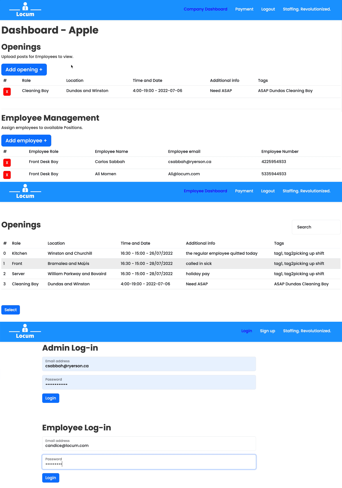

  # Locum - Staffing. Revolutionized.
    
    
  In the age of COVID, side-hustles, and the gig economy, staffing has become increasingly challenging. Named after the Latin term "Locum Tenens" which refers to an individual who temporarily fulfills the duties of another, Locum allows chain business owners to easily and efficiently leverage their existing talent pool to meet last-minute staffing needs.
  
  ## Table of Contents
  
  * [Installation](#installation)
  * [Built With](#built)
  * [Usage Information](#usage)
  * [Authors & Acknowledgements](#credits)
  * [License](#license)
  * [Contact](#questions)
  
  
  ## Installation
  The live application can be accessed using its deployed Heroku link. For developers, after cloning the repository, enter "npm i" to install all required dependencies. The database can be set up and seeded by running the command "npm run seed" at the root level of the application.
  
  ## Built With
  * JSX
  * CSS
  * JavaScript
  * React
  * Express
  * Apollo
  * GraphQL
  * MongoDB
  * Mongoose
  * Bootstrap
  * Json Web Token
  * Bcrypt

  ## Usage Information
  [Locum - Staffing. Revolutionized.](https://locum-staffing.herokuapp.com) 
    
  This application was built with scalability and adaptability in mind. With customizable features, Locum is suitable for chain companies in a wide variety of industries, from healthcare to food service. 
    
    
  
  ## Authors & Acknowledgements  
  Made with ❤️ by the Locum Team. 

  ### Author Specific Acknowledgements
  #### Veronica
  Shoutout to [Luca](https://github.com/LHBO19) for being a real one.

  ## License
  This application uses the MIT License. For more information regarding usage, please visit [this link](https://opensource.org/licenses/MIT).
  
  ## Questions?
  Contact repository author via [GitHub](https://github.com/SCScbc-Projects2022). 
  
  Contact specific repository author: 
  [Ali](https://github.com/alimomen10) - Concept + Branding, Logo (final), Custom CSS, UI/UX, Pitch + Presentation
  [Carlos](https://github.com/csabbah) - Team Lead, Frontend JavaScript, TypeDefs + Resolvers, Mutations, Full Stack Integration, Custom CSS + Mobile Responsiveness
  [Veronica](https://github.com/TOVTC) - Database Seeds, Models, React Integration, TypeDefs + Resolvers, Queries, Documentation, Heroku Deploy, Validation
  [Candice](https://github.com/candiecane7) - Debugging, Models, TypeDefs + Resolvers, Queries, Documentation
  [Cory](https://github.com/CorySillaots) - React Integration, Custom CSS, Logo Ideas
  [Anna](https://github.com/lyuhan2828) - Database Seeds

  ## Assignment Information - Group Project Three: MERN SPA Project
  ### Project Requirements
  * Use React for the front end.
  * Use GraphQL with a Node.js and Express.js server.
  * Use MongoDB and the Mongoose ODM for the database.
  * Use queries and mutations for retrieving, adding, updating, and deleting data.
  * Be deployed using Heroku (with data).
  * Have a polished UI.
  * Be responsive.
  * Be interactive (i.e., accept and respond to user input).
  * Include authentication (JWT).
  * Protect sensitive API key information on the server.
  * Have a clean repository that meets quality coding standards (file structure, naming conventions, best practices for class and id naming conventions, indentation, quality comments, etc.).
  * Have a high-quality README (with unique name, description, technologies used, screenshot, and link to deployed application).

  ### Presentation Requirements
  * Elevator pitch: A one-minute description of your application.
  * Concept: What is your user story? What was your motivation for development?
  * Process: What technologies did you use? How did you break down and assign tasks and roles? What challenges did you encounter? What were your successes?
  * Demo: Show your stuff!
  * Directions for future development.
  * Links to the deployed application and GitHub repository.